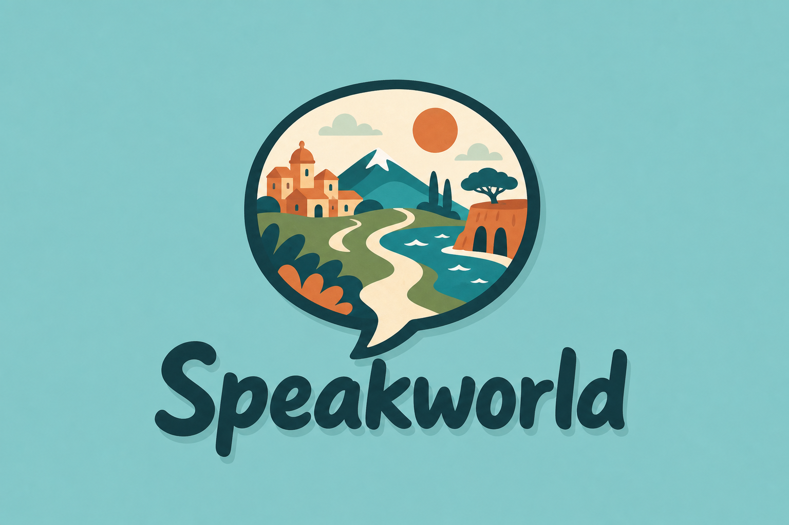

# Speakworld

<p align="center">
  
</p>

**Walk into a language.** Speakworld is a single-player Three.js language-learning game where useful conversation practice happens inside explorable, country-specific worlds instead of a lesson list.

Choose India, Japan, or Mexico; meet a local guide; learn a small bilingual phrase set; travel to the right person; and use the phrase in a contextual conversation. Each world has ten missions, local transport, navigation, ambient sound, and its own visual identity.

> **Built with Codex + GPT-5.6:** Codex, powered by GPT-5.6, was the primary development partner used to design, build, debug, and verify Speakworld. The full breakdown is in [How Codex and GPT-5.6 were used](#how-codex-and-gpt-56-were-used).

## What is playable

- Three full worlds: Hindi in India, Japanese in Japan, and Spanish in Mexico
- Ten connected, practical missions per world
- Guided bilingual tutorials from Asha, Yuki, and Lola
- Live voice role-play with contextual NPCs through the OpenAI Realtime API
- Text practice fallback when voice is unavailable
- Walking plus country-specific transport: scooter, bicycle, train, subway, and metro
- GTA-style minimap, objective marker, mission browser, collision, and third-person controls
- Reusable cached guide narration plus a distinct, wordless procedural score for every country
- Automatic first lesson after the player begins exploring

## Quick start

### Requirements

- Node.js 20.19 or newer
- npm
- A modern browser with WebGL and microphone support
- An OpenAI API key only if you want to test live voice practice or regenerate tutorial audio

### Install and run

```bash
git clone https://github.com/rehaancubess/speakworld.git
cd speakworld
npm install
cp .env.example .env.local
npm run dev
```

Open the local URL printed by Vite, normally [http://localhost:5173](http://localhost:5173).

The world, missions, text practice, cached guide narration, music, and transport work without an API key. For live NPC conversations, open `.env.local` and replace:

```dotenv
OPENAI_API_KEY=replace_with_a_new_key
```

Never place the key in browser code or a `VITE_...` variable. `.env.local` is ignored by Git. The browser sends its WebRTC offer to the same-origin `/api/realtime/session` endpoint, and only that server endpoint communicates with OpenAI using the standard API key.

## How Codex and GPT-5.6 were used

Speakworld was built through an iterative human–AI development workflow in Codex using GPT-5.6:

- **Product and gameplay design:** brainstormed the language-learning loop, refined the project from an open-world concept into guided real-life conversation practice, and structured ten missions for each language.
- **World production:** created and repeatedly refined procedural Blender Python builders for India, Japan, and Mexico; established the Blender → GLB → Three.js asset pipeline; and integrated the exported worlds into the browser.
- **Game engineering:** implemented third-person movement, camera behavior, collision, mission progression, minimap navigation, NPC markers, trains, metro/subway behavior, bicycles, and scooters.
- **OpenAI voice systems:** designed the secure server-side Realtime handshake, multilingual NPC role-play prompts, voice casting, semantic turn-taking, subtitles, time/reply limits, and text fallback.
- **Tutorial audio:** built a one-time TTS generation and manifest pipeline so the guide lessons are generated once and reused for every player instead of creating a new API call each time.
- **Computer Use:** extensively used Codex's Computer Use capabilities to operate and inspect the project in Chrome and Blender, navigate the playable worlds, compare visual results with references, capture screenshots, and test changes as a player would.
- **Visual and gameplay QA:** combined those Computer Use sessions with Codex-driven browser tests, screenshots, movement checks, collision checks, and mission/voice architecture tests to find and fix regressions throughout development.
- **Documentation and release:** used Codex to audit the public repository for secrets and oversized generated files, document setup and architecture, run the release checks, and prepare the GitHub submission.

The human creator set the product direction, chose the art and gameplay references, made the final design calls, supplied/licensed source assets, and play-tested each iteration. GPT-5.6 helped turn that direction into working, tested code and assets.

## Core experience

1. Pick the language you want to learn.
2. Walk a few steps and your guide automatically introduces the first lesson.
3. Read and hear a small target-language phrase set with its English meaning.
4. Follow the world marker to the relevant NPC.
5. Practise naturally by voice through the Realtime API, or use text mode.
6. Complete the situation and continue to the next mission or transport route.

The missions cover greetings, ordering food, shopping, directions, transit, a pharmacy visit, introductions, and other situations a traveller or new resident would actually need.

## Controls

| Key | Action |
| --- | --- |
| `W` / `S` | Walk or drive forward/backward |
| `A` / `D` | Turn left/right |
| `Shift` | Run |
| `Space` | Jump while exploring |
| `E` | Interact, talk, enter, or exit transport |
| `M` | Open the world map |

## OpenAI voice architecture

Guide narration and NPC practice use two deliberately different paths:

```text
Guide lesson: generate once with TTS → save MP3 + manifest → reuse for all players
NPC practice: browser WebRTC → local server handshake → OpenAI Realtime API → live reply
```

Live practice includes:

- Hindi, Japanese, and Spanish input transcription, NPC audio, and subtitles
- Automatic semantic turn detection—no hold-to-speak interaction
- Male/female role casting with per-country voices
- Target-language phrases with English support
- Protected alternating turns to prevent speaker feedback from truncating NPC replies
- Feedback after three learner replies and automatic feedback after six complete NPC replies
- A 150-second and six-reply cap per client exercise
- An in-memory local-development handshake limiter
- Automatic text fallback if microphone access or the Realtime connection fails

The standard API key never reaches the browser. The local limiter is not a production billing boundary; see [Production deployment](#production-deployment) before hosting publicly.

## Generate reusable guide tutorials

The repository already contains the generated tutorial clips. To regenerate them after configuring `.env.local`:

```bash
npm run audio:generate:hindi
npm run audio:generate:japanese
npm run audio:generate:spanish
# or all missing clips
npm run audio:generate:all
```

Audio is written beneath `public/assets/audio/{language}/{guide}/`. Existing files are skipped unless the generator is run with `--force`. Generated voices are disclosed in the tutorial UI and manifests as AI-generated.

## Music and sound

Speakworld generates its quiet, wordless score in the browser, so music playback makes no API calls:

- **India — Monsoon Courtyard:** tanpura-style drone, santoor-inspired plucks, soft hand drum, and hill birds
- **Japan — Sakura Footpath:** koto-inspired plucks, breath-flute tones, temple bell, and bamboo wind
- **Mexico — Valle Evening:** nylon-guitar arpeggio, soft marimba, hand shaker, and warm valley air

The audio engine also handles footsteps, landing, interactions, mission stings, transport, and rail sounds. Music ducks while a guide or NPC speaks.

## Project structure

```text
src/
  slice-preview.js           world loading and main Three.js experience
  guide-world-systems.js     missions, tutorials, objectives, and navigation
  guide-narration.js         cached tutorial playback
  realtime-practice.js       browser WebRTC practice client and text fallback
  movement-physics.js        movement/collision helpers
  country-ambience.js        per-world procedural music and sound
server/
  realtime-session.mjs       secure OpenAI session handshake and local limits
  practice-lessons.mjs       multilingual lessons, prompts, and voice casting
  aws-lambda-realtime.mjs    future AWS API Gateway/Lambda adapter
blender/
  *_builder.py               procedural world builders
  *.blend                    editable source scenes
public/assets/
  *.glb                      optimized runtime worlds
  audio/                     cached guide narration and manifests
scripts/                     browser, gameplay, voice, and audio tests/tools
```

The three current worlds are produced by the grand India, Japan, and Mexico Blender builders, exported as GLB, and loaded through `src/slice-preview.js`. Roads, mission paths, transport routes, collisions, and named scene contracts are verified in the browser after export.

## Verification

```bash
npm run build
npm run test:voice
npm run test:soundscape
npm run test:onboarding
```

With the Vite development server running, the browser suites can also be run individually:

```bash
npm run test:voice:ui
node scripts/level-ground-preview-test.mjs
node scripts/sayscape-missions-test.mjs
node scripts/exploration-preview-test.mjs
```

`test:voice` checks the approved lesson allowlist, semantic turn detection, character voice casting, server-only handshake, and absence of a client-side secret. The gameplay suites cover onboarding, level ground, movement, camera behavior, collisions, missions, transport, and waypoints.

## Production deployment

The included Vite middleware is for local development. For an AWS deployment:

1. Store `OPENAI_API_KEY` in AWS Secrets Manager.
2. Deploy `server/aws-lambda-realtime.mjs` behind API Gateway.
3. Require authenticated users before issuing a Realtime session.
4. Replace the in-memory limiter with DynamoDB or Redis and add AWS WAF limits.
5. Configure OpenAI project budgets and server-side exercise limits.
6. Host the static Vite build from `dist/` using S3 + CloudFront or an equivalent service.

## Third-party assets

Third-party model credits and licenses are recorded in [`blender/source_assets/ATTRIBUTION.md`](blender/source_assets/ATTRIBUTION.md). The Japanese torii gate source asset is licensed under CC BY 4.0 and attributed there.
